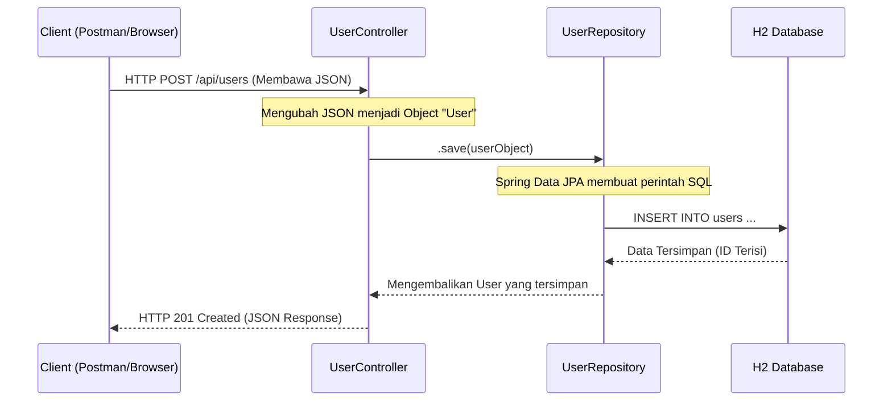

# 🌊 Alur Kerja Spring Boot & Pemahaman Database

Dokumen ini menjelaskan bagaimana sebuah *request* dari luar bisa sampai masuk ke database dan bagaimana cara melakukan query di Spring Boot.

## 1. Arsitektur Berlapis (Layered Architecture)

Secara standar, Spring Boot menggunakan konsep **Layered Architecture**. Bayangkan ini seperti dapur restoran:

1.  **Controller (Pelayan)**: Menerima pesanan (HTTP Request) dan memberikan jawaban (Response).
2.  **Service (Koki - Opsional di proyek ini)**: Tempat logika bisnis bernaung. Memproses data sebelum disimpan atau sesudah diambil.
3.  **Repository (Gudang/Supplier)**: Bertugas mengambil atau menyimpan data ke database.
4.  **Model/Entity (Barang)**: Representasi data yang dipindahkan (misal: data User).

---

## 2. Alur Request: Dari Klik sampai ke DB

Berikut adalah urutan kejadian saat Anda memanggil API `POST /api/users`:



### Detail Langkah:
1.  **Client** mengirim data JSON berisi `name` dan `email`.
2.  **UserController** menerima data tersebut lewat anotasi `@RequestBody`.
3.  **UserRepository** dipanggil. Karena repository kita meng-extend `JpaRepository`, ia sudah punya fungsi bawaan seperti `.save()`.
4.  **Spring Data JPA** (Hibernate) secara otomatis menerjemahkan object Java tersebut menjadi perintah SQL `INSERT`.
5.  **Database** menyimpan data dan memberikan ID unik.

---

## 3. Cara Melakukan Query di Spring Boot

Spring Data JPA memudahkan kita melakukan query tanpa harus menulis SQL mentah secara manual.

### A. Query Bawaan (CRUD)
Tanpa menulis kode apapun, `UserRepository` sudah punya fungsi:
- `findAll()` -> `SELECT * FROM users`
- `findById(id)` -> `SELECT * FROM users WHERE id = ?`
- `save(user)` -> `INSERT` atau `UPDATE`
- `deleteById(id)` -> `DELETE WHERE id = ?`

### B. Query Berdasarkan Nama Method (Query Methods)
Anda bisa menambahkan pencarian khusus hanya dengan menamai method di `UserRepository`.
Contoh jika ingin mencari user berdasarkan email:

```java
public interface UserRepository extends JpaRepository<User, Long> {
    // Spring akan otomatis membuat query: SELECT * FROM users WHERE email = ?
    Optional<User> findByEmail(String email);

    // Cari user yang namanya mengandung teks tertentu
    List<User> findByNameContaining(String name);
}
```

### C. Menggunakan Query Manual (@Query)
Jika query-nya sangat kompleks, Anda bisa menggunakan anotasi `@Query`.

```java
@Query("SELECT u FROM User u WHERE u.email LIKE %:domain%")
List<User> findUsersByEmailDomain(@Param("domain") String domain);
```

---

## 4. Cara Tes Query secara Langsung

Jika Anda ingin mencoba query SQL mentah di proyek ini:
1.  Jalankan aplikasi.
2.  Buka [http://localhost:8080/h2-console](http://localhost:8080/h2-console).
3.  Setelah login, ketik perintah di area teks:
    ```sql
    -- Contoh Query
    SELECT * FROM users;
    SELECT * FROM users WHERE name = 'Budi';
    ```
4.  Klik **Run**.

---

## 💡 Ringkasan
- **Request** masuk melalui **Controller**.
- **Controller** memanggil **Repository**.
- **Repository** bicara ke **Database** lewat **JPA/Hibernate**.
- Anda bisa membuat query baru hanya dengan menulis nama method yang benar di **Repository**.
